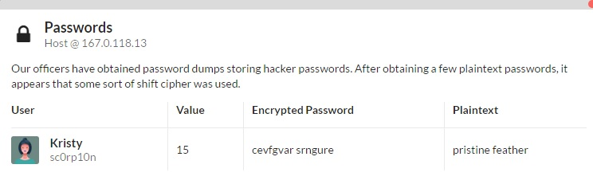

# Crypto 2
> Our officers have obtained password dumps storing hacker passwords. After obtaining a few plaintext passwords, it appears that some sort of shift cipher was used.

> Encrypted Password: cevfgvar srngure

We try decoding it as a caesar cipher using [this](http://www.xarg.org/tools/caesar-cipher/), with the key set to guess, and get that the password is
`pristine feather`
