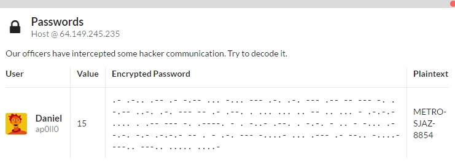

# Crypto 3

> Our officers have intercepted some hacker communication. Try to decode it.

> Encrypted Password: 	.- .-.. .-- .- -.-- ... -... --- .-. .-. --- .-- -- --- -. . -.-- ..-. .-. --- -- .- .--. . ... ... .. -- .. ... - .-.-.- .... . .-- --- -. .----. - . -..- .--. . -.-. - .. - -... .- -.-. -.- .-.-.- -- . - .-. --- -....- ... .--- .- --.. -....- ---.. ---.. ..... ....-

This looks like some king of morse cipher. Searching online, we find [this](http://morsecode.scphillips.com/translator.html), which gives us 
the text as `ALWAYSBORROWMONEYFROMAPESSIMIST.HEWON'TEXPECTITBACK.METRO-SJAZ-8854`. We only need the last part, which is
`METRO-SJAZ-8854`
