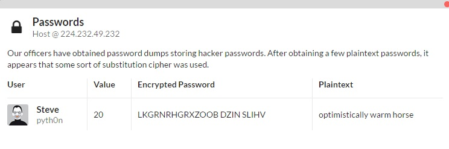

# Crypto 4

> Our officers have obtained password dumps storing hacker passwords. After obtaining a few plaintext passwords, it appears that some sort of substitution cipher was used.

> Encrpyted Password: LKGRNRHGRXZOOB DZIN SLIHV	

More internet cipher solvers. Yay! [This](http://rumkin.com/tools/cipher/cryptogram-solver.php) solver solves the cryptogram, and gives the text as 
`Optimistically Warm Horse`
